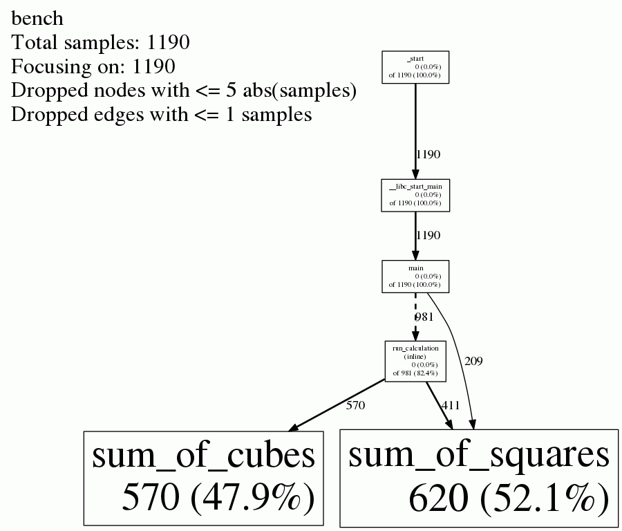
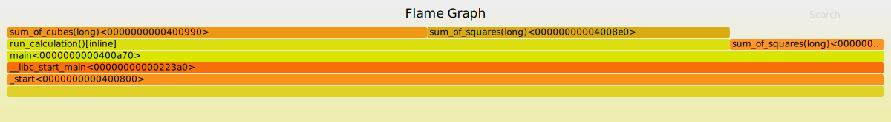

## Profiling

Premature optimization is the root of all evil -- *Donald Knuth*

* Do **not** write complicated code because you think it is faster
* Optimize only after proper measurements


## Google Perftools
https://github.com/gperftools/gperftools

* Performance and Memory (Heap) profiling
* Simple command line usage
* Analyze profiling data as text or graphically


## A simple example

```cpp
#include <vector>
#include <iostream>

long sum_of_squares(long N) {
  std::cout << "squares" << std::endl;
  long res = 0;
  for (int i = 1; i <= N; ++i) { res += i * i; }
  return res;
}

long sum_of_cubes(long N) {
  std::cout << "cubes" << std::endl;
  long res = 0;
  for (int i = 1; i <= N; ++i) { res += i * i * i; }
  return res;
}

long run_calculation() { return sum_of_squares(1e10) + sum_of_cubes(1e10); }

int main() {
  std::cout << "Start" << std::endl;
  long result = sum_of_squares(5e9) + run_calculation();
  std::cout << "Result: " << result << std::endl;
  return 0;
}
```


## Profiling Steps

1. Compile with optimization and debugging flags
   `g++ -O3 -g bench.cpp -o bench`
2. Generate the profiling data
   `LD_PRELOAD=path_to_libprofiler.so CPUPROFILE=bench.prof ./bench`
3. Analyze the profiling data, e.g.
   `pprof --text bench bench.prof`

```
Total: 1190 samples
     620  52.1%  52.1%      620  52.1% sum_of_squares
     570  47.9% 100.0%      570  47.9% sum_of_cubes
       0   0.0% 100.0%     1190 100.0% __libc_start_main
       0   0.0% 100.0%     1190 100.0% _start
       0   0.0% 100.0%     1190 100.0% main
       0   0.0% 100.0%      981  82.4% run_calculation (inline)
```


## Callgraph

`pprof --svg bench bench.prof > bench.prof.svg`




## Flamegraph

`pprof --collapsed bench bench.prof | ./flamegraph.pl - > out.svg`




## Resources

* https://github.com/gperftools/gperftools
* https://github.com/brendangregg/FlameGraph
